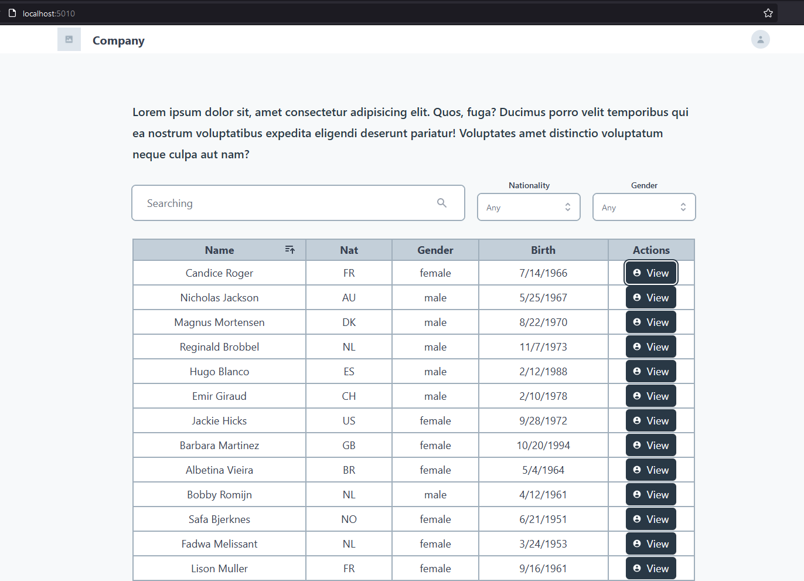
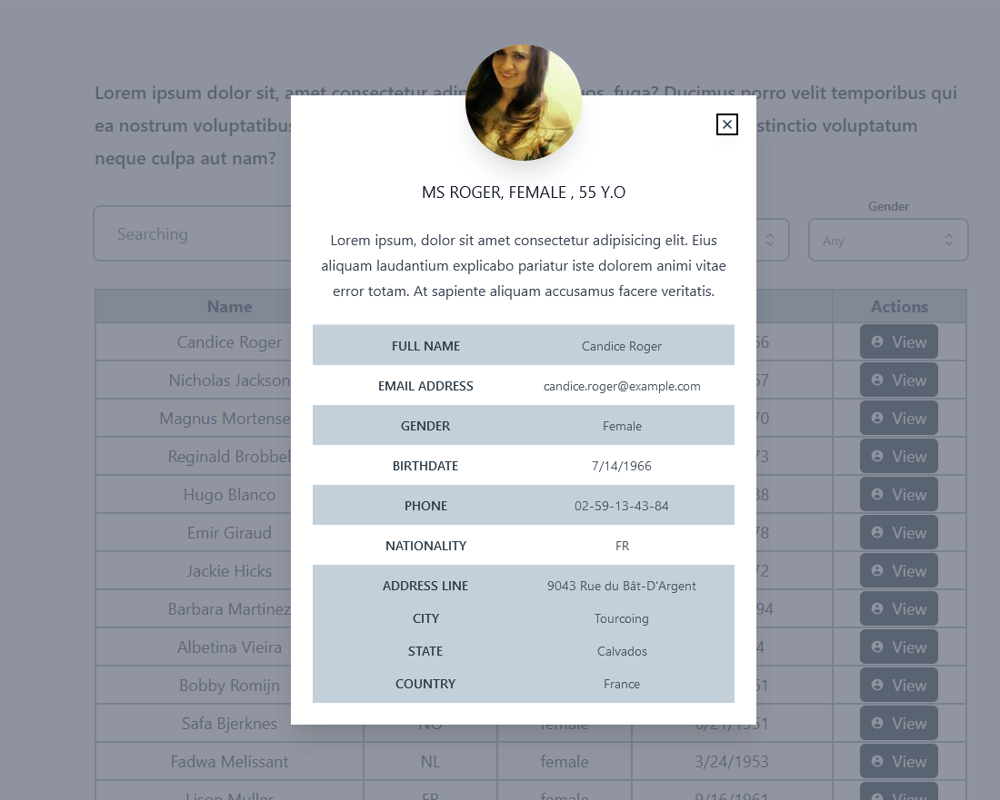
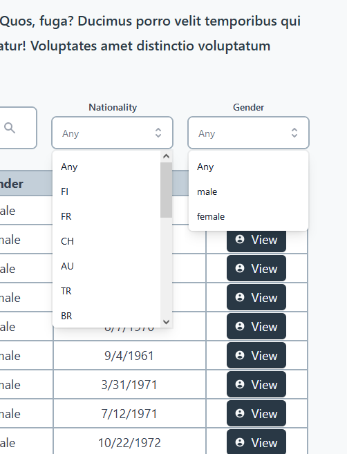
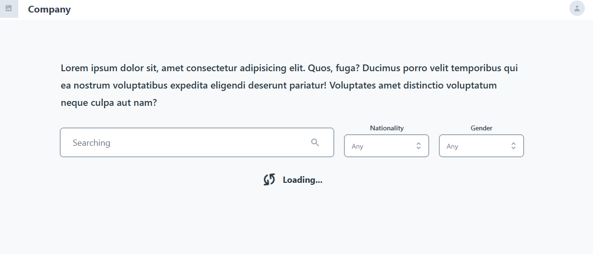
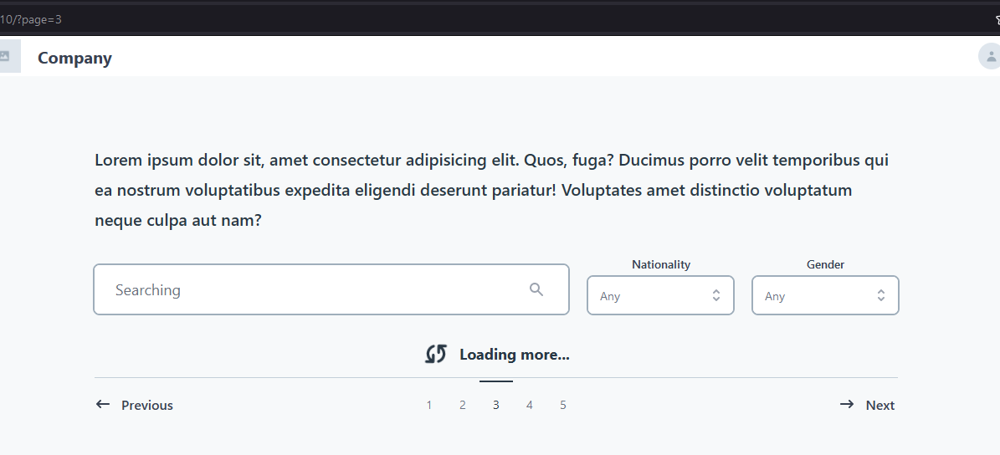
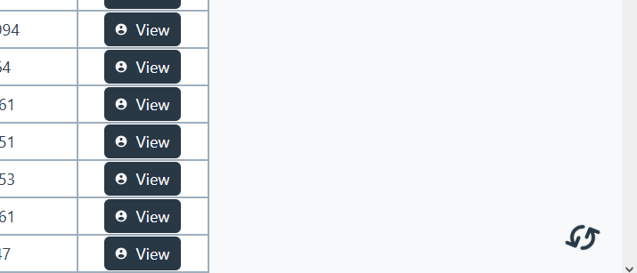

# Front-End Challenge by Coodesh🏅 2021

## Introdução

Este é um desafio para testar os conhecimentos de Front-end;

O objetivo é avaliar a forma de estruturação e autonomia em decisões para construir algo escalável utilizando um framework moderno javascript.

## Case & Objetivo

A empresa Pharma Inc, está trabalhando em um projeto em colaboração com sua base de clientes para facilitar a gestão e visualização da informação dos seus pacientes de maneira simples e objetiva em um Dashboard onde podem listar, filtrar e expandir os dados disponíveis.
O objetivo nesse projeto é trabalhar no desenvolvimento do Front end que consumirá a API da empresa Pharma Inc seguindo os requisitos propostos neste desafio.
A tela inicial do projeto será um lista de pacientes que deverá conter um buscador para facilitar filtrar todos os que são exibidos na lista, proposta:


Para obter os dados, utilizaremos a API do Random User:

* https://randomuser.me/api/

Exemplo da resposta:

``` json
{
   "results": [
       {
           "gender": "female",
           "name": {
               "title": "Ms",
               "first": "Alea",
               "last": "Christoffersen"
           }
       }
   ],
   "info": {
       "seed": "2f10116f1799d353",
       "results": 1,
       "page": 1,
       "version": "1.3"
   }
}
```

Além de realizar a request, devemos aplicar alguns filtros na API:

* Limitar em 50 resultados por request
* Adicionar o parâmetro de paginação para controlar o `Loading more`

### Visualizar paciente

Na coluna de ações da tabela, existe o botão visualizar para expandir os dados dos pacientes. Seguir o modelo proposto:


Devemos exibir os seguintes campos do paciente:

* Imagem
* Nome completo
* Email
* Gênero
* Data de nascimento
* Telefone
* Nacionalidade
* Endereço
* ID (Número de identificação)

Extras
Além do desafio proposto com as duas telas, temos alguns diferenciais:

* **Diferencial 1** Adicionar um filtro por Gênero na tabela;
* **Diferencial 2** Configurar o buscador para poder filtrar por nome e nacionalidade;
* **Diferencial 3** Adicionar o paginador rota para facilitar compartilhar o link e manter a posição na lista;
* **Diferencial 4** Escrever Unit Tests ou E2E Test na Lista de Pacientes. Escolher a melhor abordagem e biblioteca;
* **Diferencial 5** Configurar Docker no Projeto para facilitar o Deploy da equipe de DevOps;

## Proposta

### Tela inicial



### Ver usuário



### Filtros



### Primeiro load da página inicial



### Load de uma rota (não cacheada)



### Background load



## Tech stack

* Framework
    * React
    * React-Router-DOM
* Style
    * Tailwind CSS
    * Headless UI
    * Hero Icons
* XHR
    * React-Query
    * Axios
* Bundler
    * Vite
* MISC
    * Typescript
    * Prettier
    * Eslint
    * React-Debounce-Input

## Instruções

Instalar dependências

`npm install`

Após instalar, iniciar uma das builds:

* Development build

`yarn dev` ou `npm run dev`

* Production build

`yarn build && yarn serve` ou `npm run build && npm run serve`

### Docker (production build)

`yarn start` ou `npm run start`
